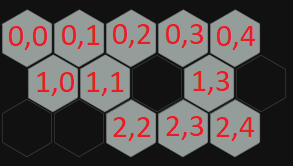
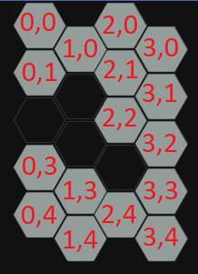
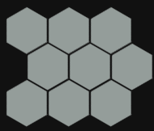
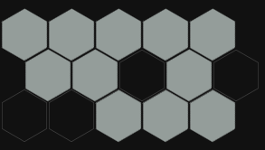
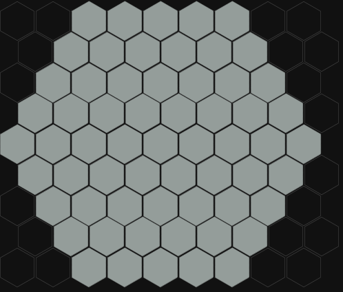
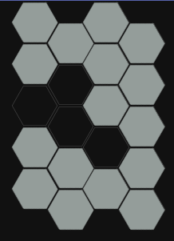

# Tabletop Game Description Language

## Table of Contents
- [Tabletop Game Description Language](#tabletop-game-description-language)
  - [Table of Contents](#table-of-contents)
- [Language primitives](#language-primitives)
- [Types](#types)
  - [Object type](#object-type)
  - [Predefined types](#predefined-types)
  - [Supplied predefined types](#supplied-predefined-types)
  - [Input types](#input-types)
  - [None Value](#none-value)
  - [Lists](#lists)
  - [Type checking](#type-checking)
  - [Type casting](#type-casting)
- [Expressions](#expressions)
  - [Binary Operations](#binary-operations)
    - [Math Operation](#math-operation)
    - [Comparison Operations](#comparison-operations)
    - [Equality Operations](#equality-operations)
    - [Logic Operations](#logic-operations)
    - [Generic operations](#generic-operations)
  - [Unary Operations](#unary-operations)
  - [Order of evaluation](#order-of-evaluation)
- [Statement](#statement)
  - [Flow Control statements](#flow-control-statements)
- [Actions](#actions)
  - [Inputs](#inputs)
    - [Input Filters](#input-filters)
    - [Input Modifiers](#input-modifiers)
    - [Optional Inputs](#optional-inputs)
  - [Triggers](#triggers)
    - [State category](#state-category)
    - [Trigger Modifiers](#trigger-modifiers)
    - [Placeable Movement Events](#placeable-movement-events)
    - [State Events](#state-events)
    - [State Attribute Events](#state-attribute-events)
  - [Global and Named](#global-and-named)
  - [Phases](#phases)
  - [Action priority](#action-priority)
  - [Action transaction](#action-transaction)
    - [Action Failures](#action-failures)
- [State](#state)
  - [Attributes](#attributes)
  - [Value Substate](#value-substate)
  - [Action Substate](#action-substate)
  - [Scopes](#scopes)
    - [Local](#local)
    - [Groups](#groups)
    - [Global](#global)
  - [Transferability](#transferability)
    - [Local states](#local-states)
  - [Group states](#group-states)
- [Interactables](#interactables)
  - [Placeable](#placeable)
  - [Stackables](#stackables)
- [Stack](#stack)
- [Players](#players)
  - [Starting player](#starting-player)
  - [Winner selection and game end](#winner-selection-and-game-end)
  - [Player expressions](#player-expressions)
  - [Turns](#turns)
    - [Default turn](#default-turn)
- [Board](#board)
  - [Tile](#tile)
  - [Groups](#groups-1)
    - [Hex cell type](#hex-cell-type)
    - [Square cell type](#square-cell-type)
    - [Adjacency cell type](#adjacency-cell-type)
    - [Border Cells](#border-cells)
  - [Board Changes](#board-changes)
  - [Group Changes](#group-changes)
- [Movement](#movement)
- [Goals](#goals)
- [Setup](#setup)
- [Verbs](#verbs)
- [Inheritances](#inheritances)
  - [Override](#override)
- [Keywords](#keywords)

# Language primitives
- identifier: a sequence of letters or numbers starting with a letter;
- comments: a comment is everything till the end of line character from the double slash characters `\\` 
  - they are ignored and are only for informing, documenting or in general leaving messages inside the code
# Types 
  
## Object type
the object type is the base type of all the types in the language, you can always upcast (cast to object) to the object type 
it has no attached functionality other than being used to have a simpler way to use one argument for different possible type.
to go back to the orignal type from the object type a downcast must be performed.

## Predefined types 
TGDL supports a small set of predefined types for simplicity and ease of use for non skilled users.
The standard supported predefined types are:
- decimal: for numbers both integer and floating point
- string: for descriptions or storing text ( no string manipulation is provided and they are not supported in the majority of expression operations )
- bool: boolean values true and false

## Supplied predefined types
Supplied predefines types are user declared types ( or defaults if not declared ) that are automatically supplied to 
the consumer action, they are the following types:
- player 
- global states
- board 

## Input types 
Inputs types are choosen by the player or players when required in an action they are:
( **Experimental: input types can be supplied from another action in a callable** )
- local and group states
- tile

## None Value
`none` is a special value that any type can have and it indicates the absence of the value for that specific attribute ( unassigned )

the none value behaves differently than normal types in comparisons:
- if two attributes with none value are confronted they will always be different `attribute1 = attribute2 => falls if attribute1 and attribute2 are none`
- an attribute with none value is equals to a none literal `attribute == none -> true if attribute is none`
- a none literal is equals to another none literal `none == none => true`

## Lists
List are a set of multiple instances of the same type that are aggregated under a single named variable.

Declaration: `type[] <list_name>`
Access to a single instance: `<list_name>[decimal]` (if a number with a decimal part is inserted, the decimal is ignored), when an out of index access is done it returns none
List Lenght: `<list_name>.lenght`
Inserting: `<list_name>[decimal] = <instance>` to append `<list_name>[<list_name>.lenght] = <instance>`
Initialization: `type[] <list_name> = { <instance>, <instance2>, <instance3> };` ( can be empty to initializes an empty list)

Appending: `<list>.append(<other>)` appends the list other to the list list
Clearing a list: `<list>.clear()` removes all entries from the list, returning it to an empty list
Check if list has value: `<list>.contains(<value>)` returns true if value is inside list
Find element index: `<list>.find(<value>)` returns the key if value is found, otherwise none
Remove element at index: `<list>.removeAt(<decimal index>)` removes the value at the index 
Remove element: `<list>.remove(<value>)` removes the value from the lsit 
Remove a list: `<list>.removeRange(<other_list>)` removes all the elements of other_list from list

## Type checking
Type checking is done trough the `is` keyword: `<attribute> is <type>` is a type checkign expression and will return true if the attribute
is of type `<type>`, otherwise return false

## Type casting
type casting is used to change an attribute from a type to another type, it is done trough the `as` keyword `<type> id = <val> as <type>`
the as expression has two possible returns:
- the variable with the new type if it is allowed
- none if the variable is not allowed to be of the new type

# Expressions 
An expression is a combination of one operator and one or more operands.
Every type of expression defines the result type and legal operands.

## Binary Operations
A binary operation is defined as an expression that involves two operands and one operators.
they are left associative by default, if otherwise it will noted as such.

### Math Operation
Math operations only allow **decimal** operands and as result a **decimal** type:
- addition: `<operand> + <operand>`
- substraction: `<operand> - <operand>`
- multiplication: `<operand> * <operand>`
- division: `<operand> / <operand>`
- power: `<operand> ^ <operand>` ( right associative )
- modulo: `<operand> % <operand>`

### Comparison Operations
Comparison operations only allow **decimal** operands and as result a **bool** type:
- less than: `<operand> < <operand>`
- greater than: `<operand> > <operand>`
- less or equal than: `<operand> <= <operand>`
- greater or equal than: `<operand> >= <operand>`

### Equality Operations
equality operations allow both **decimal** or **boolean** operands, the two operands must be of the same type in the same operation,
and as result **bool** type;
- equal: `<operand> == <operand>`
- not equal: `<operand> != <operand>`

### Logic Operations
logic operations only allow **boolean** values and as result **bool** type
- and: `<operand> and <operand>`
- or: `<operand> or <operand>`
- xor: `<operand> xor <operand>`
- nand: `<operand> nand <operand>`

### Generic operations
generic operations don't fall under a specific category:
- state attribute access: '<state>.<attribute>'
- is operation: `<construct> is <type>`: returns a boolean value, true if the construct is of type otherwise false

## Unary Operations
A unary operation is defines as an expression that involves one operand and one operator, the following are supported in TGDL:
- plus: `+<operand>`
- minus: `-<operand>`
- not: `not <operand>`

## Order of evaluation
1. state attribute acces
2. plus and minus
4. pow
5. multiplication, division and modulo
6. addition and subtraction
7. comparison operations
8. equality operations
9. not
10. and
11. or

# Statement
a stamentent is a combination of clauses and expressions that end with a semicolon, the following are supported in TGDL
- return: `return <expression>;`
- expression: `expression;` 
- assignment: `<attribute or variable> = <expression>;`
- declaration: `<type> <attribute or variable>;`
  - an assignemnt can be chained to perform an initialization of the declared variable or state attribute
- turn: `pass expression;`
- instantiate construct: `new <construct type>;`;

anything that isn't an expression or a body is a clause (ex. return, =, if, while, pass, ...).

## Flow Control statements
- if: `if expression {}`
  - else: `else {}`
  - else if `if {} else if {}` 
- while: `while expression {}`
  - break: exits the while without evalueting the expression
  - continue: goes to next iteration (it evalueates the expression, if false exits)


# Actions
actions are a combination of instructions set by the user that are run on a trigger.

example:
```
action <action>
{
  input   { }
  require { }
  trigger { }
  effect  { }
}
```

an action can have any combination of the other tags **input, require, trigger and effect**:
- **WARNING**: if an action has no triggers it will never be called

any of the actions can be deactived or activated trough the allowed attributge associated with an action `<state>.<action>.allowed = <boolean>;`

all actions can be called using the parenthesis operator `()` 

## Inputs
An action input are the constructs that will be used troughtout the action definition and execution.
It works trough method dependency injection following the subsequent rules:
1. if its a supplied type it will be supplied from the translation / interpreter
2. if its a declared type it will be asked to the user to choose (if the require are satisfied else no choice is given and the action fails, check action fail):
3. if its a Predefined types it will ask the user to choose ( if possible restrict the values so that it will always satisfy the require, or give an indication when satisfied)

```
[optional] [<modifier>]input <type> <idenfitier>
{
  filters
}
```

**Attention**: every action in the action substate of a specific state has as automatic input its value substate ( this could generate a name conflict if an input
has the same identifier of an attribute of its value substate)

Inputs can be used inside an effect, it will instantiate a variable with the defined type and identifier that can be used only inside the scope of the effect.
Effect Inputs have the same behavior of Action inputs.

### Input Filters
Input filters can be defined using a block after the input statement that returns a boolean value, true if the current examined value passes the filters or false if it does not pass the filter.

an input filter reduces the possible selections from all the instances of a certain type to a specfici subtype satisfying the given filter

```
input <type> <name>
{
  <statements>
}

// alternative input filter declaration
input <type> <name>
{
  filter [<type> <name>]
  {

  }
}
```

alternative filter declaration uses the filter keyword ( only accessible in the input context block ) that defines a filter for the 
specific type, used generally for list filters ( see input filters for list ), and a generic filter that derives the type and name of the
object to filter on from the input parameters.

multiple filters mapped on the same type will be evalueated one after the other, if one fails the input fails.

an example can be of an action that can be applied only on states with higher points
```
state player_state
{
  decimal points = 0;

  action on_higher_points
  {
    input player_state other
    {
      return other.points > points;
    }
  }
}
```

**WARNING INPUT FILTER FOR LIST**
to have better control on a list, its input filters need two separate definitions one to filter for the instances that will go in the list
and one to filter if the list is in an allowed state or if the input will fail.

**ATTENTION input lists cannot be used with predefined types**

```
state example 
{
  decimal points = 0;
}

action list_input
{
  input example[] examples 
  {
    filter example ex 
    {
      return ex.points < 10 and ex.points > 0;
    }
    filter
    {
      return examples.lenght < 3 and examples.lenght > 0;
    }
  }
}
```

first the filter for a single example type is run so that the player can choose between one of the choices,
after every selection made by the users the generic filter runs to check if the lists fails the check thus failing the input

**ATTENTION** to get all of a non literal type in a list the **all** keyword can be appened to the input statement, if a all keyword is used
there should no input filters.
the all keyword bypasses the need for a player to select the input

inputs are resolved in order of definition and subsequent inputs can use result of the previous input 

### Input Modifiers
Input modifiers are needed to modify the behavior of the input tag, they are appened after the default definition input
```
input <type> <identifier> [<modifier>] [{ filter }]
```
the possible modifiers are:
- `player [<decimal>]` : ask a player for input, it is the default input if no number is given the current player is used
- `auto`: no player input, filter from all the avalaible instances of the requested type. If not filter is given all instances will be accepted.
  - exceptions: if no type satisfies the defined filter if the input type is a list it will return none if optional else the action will fail
- `verb`: special input  that can be used only in verbs, defines inputs that need to be passed trough the calling statement
  
### Optional Inputs
an optional input defines in the its definition the `optional` keyword and it means that input can assume the value of none when no input is given by the
corresponding player or no input satisfies the defined filters 

## Triggers
A trigger is a body of statementes than when evalueated true will launch the corresponding effects

```
trigger <trigger event> [<params>]
{
  <statements>
}
```

possible triggers events are:
- `movement <movement>`
- `<state>.action` ( < state > can not be in input )
- `change <state>.value`
- `<state>.<action>.<phase>` 

a trigger event is formed by 3 pieces: `on <construct> <event>`:
- on is the keyword that defines the trigger event
- construct defines the macro category of the event ( state, stack, interactables, attributes, ect... )
- event is the event of the macro category

for each construct you can use specific constructs that were defined by the programmer like a specific state, or a 
general construct that is identifier by the identifier name of that construct ( ex. state will encompass all the states )

### State category
<center>
<table>
<tr>
<th>construct</th>
<th>event</th>
<th>event structure</th>
</tr>
<tr>
<td>state.attribute</td>
<td>change</td>
<td>
<pre>
{
  string state: which state identifier of the state that had the attribute change
  string attribute: attribute name that has changed
}
</pre>
</td>
</tr>
</table>
</center>

- on action {}
- placeable
  - on placement
  - on removal
  - on movement
- stackable
  - on drawn
  - on discarded
  - on kept
- stack
  - on draw card
  - on shuffle
  - on reshuffle
  - on put card
  - on discard
- turn
  - on turn activation
  - on turn disactivation
  - on turn phase change

special events:
- player

### Trigger Modifiers
```
trigger <event> [for <name>] [<modifier>]
```
the possible triggers modifiers are:
- after: the trigger activates the effect after the triggering action terminated
- before: the trigger activates the effect before the triggering action is started
- fast: as soon as the event is thrown the triggers will evalueate

### Placeable Movement Events
### State Events
### State Attribute Events

## Global and Named
Triggers, requires and effects can be associated to a shared subgroup through the name funcionality

```
trigger [for <identifier>] {}
require [for <identifier>] {}
effect [for <identifier>] {}
```

A named require, trigger or effect will interact only with the require, triggers or effects within the same subgroup.
An identifier can be assigned to **multiple** triggers, require and effects if needed.

Global action triggers, requires and effects are not named and can interact with the named counterparts, 
establishing a gerarchical hierarchy between the two.
A global trigger, require or effect is global to where it is defined ( action, phase ):
- global trigger: starts the execution of the global effect
- global require: filters the input / blocks the execution if no input satisfies the conditions 
To prevent code duplication and encourage use of naming when possible, the global action triggers, requires and effects can reference 
the named counterparts trough their identifier and boolean operations (not, and, or, nand, xor).

```
require for A {}
require for A {}
require for B {}
require { A and B} // satisfied when both A and B are satisfied
```

## Phases
Phases are introduces for multi effect actions with different requirements and / or triggers.
A phase declaration can only contain trigger, require and effect ( both named and global for that phase)


a phase is declared like in the following example.
```
phase
{
  trigger { }
  require { }
  effect { }
}
```

phases ( and actions ) have the option of a specifier in the following list that changes the behaviour of the effects:
- choice <n>: not applicable to a callable action, asks a player to choose n effects that have satisfied requires
- sequence: effects are executed in order of definition
- simultaneos ( experimental )

## Action priority 
As default the actions are executed in the same order as they are defined in the file, that equals a priority of value 0.
An action priority can be changed trough the keyword `priority <decimal>` that assigns a arbitrary priority to the action.
a lower number or means a lower priority and viceversa a higher number means an higher priority

example:
```
action low_prio priority -10 {}
action default_prio {}
action default_prio_spec priority 0 {}
action high_prio priority 10 {}
```

## Action transaction
a player action creates a tree of changes trough its effects and the effects of the triggered actions called a transaction.
if a transaction has failures all the transaction is cancelled and its effects are reverted

### Action Failures
an action fails when a it reaches a failure statement:
- `fail "message";` -> fails the entirety of the transaction
- `cancel [<effect>] "message"` -> 
  - if no effect is specified fails only the global effect and stops all the triggers from activating ( and reverts the triggers that activated with the before keyword )
  - if an effect is specified it fails that specific effect
  - if `all` is specified for effects the entire action fails without propagating backwards to the trigger action 

# State
A state is a construct to describe values and actions related to eachothers such as roles.
a state is divided in two substates, the value substate and the action substate.

a state can be refer to itself in the actions trough the use of the `this` keyword that means this instance of the construct

a state has reference to the player or players that are associated with:
- `<state>.player` works only for local states and returns the player associated with that specific instance of the state
- `<state>.players` is used for local and group states and return all the players that have that specific state  

## Attributes
A state attribute is defined as a variable declaration (and optionally an assignment) inside the state declaration

```
state <state>
{
  <type> <identifier> = <default> or <none>;
  <type> <identifier> = <default> or <none>;
}
```

the **none** keyword rapresents the absence of an assigned value to an attribute and it is the default for every type if assigned a default initializer value.

## Value Substate
the value substate contains the state attributes which the state actions or other state actions can use.
it is implicitly defined as the set of attributes defined in the state declaration ( if no attribute is declared then the value state is empty ).

## Action Substate
The action substate is the set of all defined action inside a state declaration.
It can be accessed and/or modified by any other action or pseudo-action if the state containing the action substate is not decared with the **sealed** keyword.

## Scopes
State scopes change the behaviour and attachment of a state to a player

### Local
```
local state <state>
```
the local scope is the default scope, they are transferrable state with a unique instance for each player that it was assigned it.
local states are the meat of a TGDL program and manage abstractions such as roles, default player actions, ect...

### Groups 
```
group state <state>
```
the group scope defines a state that has one instance assigned to a subgroup of players.
players can be assigned or removed from the group state trough a transfer.

group states serve the purpose of having values or actions shared between a subset of players 

**WARNING:** at the moment only one instance of a defined group state is allowed due to syntax restrictions in defining multiple instances 

### Global
```
global state <state>
```
the global scope defines a state that has only one instance and cannot be assigned to any player, the ownership of the global state is the game itself.
a global state defines values and actions that encompass values outside of the players but that can be influenced from them in some shape o form.

an example of a global state use case is the presence of global parameters that dictate the flow of the game, the parameters have no attached player to them
but the are still a part of the game.

global states are a supplied type, **no other identifier can be the same as a global state name**

## Transferability

### Local states
local states can be transferred from a player to another player trough the **transfer** operation.
The transfer keeps the value state constant during the transfer opereration ( a special trigger can be setup to reset/change the value substate on transfer to another player ).

the player that acquired the state can now access the state substates, on the other hand the other player has lost the rights to access the substates of the transferred state

## Group states
a group states cannot be transferred as a local state, the transfer operations change the attachments of players to the group states.
players can be removed or attached to a group state, acquiring the access to its substates.

actions can be specified with special triggers ( on remove and on attach ) to perform actions on the respective removal or attachment of a player to the group state
( this special trigger, can be specialized with a state name to trigger only when attached or deattached from that specific state )

**WARNING:** the special triggers are available to local states as well

# Interactables 
interactables are objects that abstract the concept of interaction with the player trough phisical objects like tokens, cards, ect...

```
interactable <name> [<type>|<type>,<type>,...]
```

## Placeable
Placeable is a type of interatable, it interacts with tiles and board groups
Placeable have specialized triggers to enhance their functions (defined in the respective section reletaed to action triggers):

a placeable stores a reference to the tile that it occupies ( if not placed the tiles is none ).
and viceversa a tiles stores the reference to all the placeable placed on itself trough a placeable list

## Stackables


# Stack

# Players
A player is defined as a decimal, every state has a hidden state attribute called `player` that corresponds to the player to which the state is attached to.

## Starting player
the starting player is always the player numbered 0.

## Winner selection and game end
`winner <player> [,<player>]*`: sets the winner or winners for the game and afterwards ends the program

## Player expressions
a player expression is a special expression that returns a player object

a player is identifier with a number from 0 to (number of players - 1) and they can be used as numbers with the exception
that if a player object is used in an expression it becomes a player expression and it will always return the result by applying the following formula 
```
{
  r modP              r >= 0
  (P - |r|modP)modP   r <  0 
}
```
where:
- r = the result of the expression
- P = the number of players in the game
- mod = the modulo operator 

the formula ensures that the result of the **player expression** is always a number between 0 and and the (number of players - 1) so that it can be mapped 
automatically to one of the players objects.
Furthermore it allows easy to use operations on the player objects to retrieve a player form another player number trough its cyclicity forward and backwards

some examples to demistify the formula, all the exaples will have a number of players equal to 4 ( common in table top games ) and starting player (player = 3):
`player + 1 => player 0`
`player - 1 => player 2`
`player +- 4 => player 3`
`player + 5 => player 0`
`player - 5 => player 2`

## Turns
A turn defines the flow of the game by using phases, it is fundemental to any game.

to pass a turn the `pass` keyword is used: `pass [<player expression>] [to <turn phase>];` 
- the result of the player expression will be the active player
- a specific phase of the current active turn can be selected with the `to <turn phase>` optional parameter
- **ATTENTION**: a pass call doesn't terminate the current active branch, so if another pass call is used the previous will be overridden ( as if the previous pass call was never executed )

```
// the simplest turn is defined as the following
turn <identifier>
{
  default
  {
    pass player + 1;
  }
}

// examples with phases 
turn <identifier>
{
  phase A {}
  default
  {
    pass player + 1 to A;
  }
}
```

if there is a need for multiple turns the current active turn can be changed by using the `use` keyword, or more specifically:
```
use turn <turn identifier>;
```

### Default turn
The default turn, or default section of the turn, is the block of code that is called on a default `pass` call
The default section has access to the global constructs like global states, boards, ect... furthermore inside the default tag two more arguments can be used by default:
- player: identifies the current active player 
- phase: identifies the current active phase

these arguments can be used to define complex turns flows partially detaching them from the code base trough an agnostic default pass call

**ATTENTION**: a `pass` call if used with arguments like `player expression` or `phase specificier` will cease to be a default pass call and **won't** call the default section
```
// sample turn used for the following two examples of normally used turn flows
// obviously the default tag would've been inside the turn
turn A
{
  phase A1 {}
  phase A2 {}
}

// example single vertical turn: a player must do all the phases then second player ect...
default 
{
  if(phase == A1) 
  { 
    pass player to A2; 
  }
  else 
  {
    pass player + 1 to A1;
  }
}

// example every player does phase before passing to next phase
default
{
  if(player != <number of players> - 1)
  {
    pass player + 1 to phase; // pass the next player to the same phase
  }
  else
  {
    if(phase == A1)
    {
      pass player 0 to A2; // 0 could be substituted with a global state player attribute that is changed if the first player changes 
    }
    else
    {
      pass player 0 to A1;
    }
  }
}

```

# Board
the board is the construct used to rapresent something that can be interacted with by the players trough placing tokens, claiming cells or other actions.
it is globally defined, meaning there is only one instance of the board in the entire game, a board can have attributes.

## Tile 
a tile is a specialized state-like definition trough the **tile** keyword, it can have multiple instances of the same declaration like local states and players.

```
tile <cellname>
{
  <attributes>
  <actions>
}
```

the concept of tile is abstracted by its geometrical nature that is defined by the group type

tiles have two implicit attributes:
- `board`: reference to the global board
- `group`: reference to the group in which they are attached

to do group manipulation or other that requires a specific group, type checking and casting can be used
```
if(<tile>.group is <group>)
{
  <group> <id> = <tile>.group as <group>;
}
``` 

## Groups
a board contains groups of tiles, every group can contain only one type of cell between the following:
- hex cells
- square cells
- adjacency

like the board, a group is globally defined and can have attributes ( they are declaration and assignement statement inside the group beside the group tiles definition)

all the groups can contain the blank cell (used only for spacing is an empty space) used in the group declaration with the keyword `b`
the cell type is used to define default terms like **adjancency** and **coordinates**,  

you can access a group tiles by using the square brackets operators like if it was a grid of tiles `group[x][y]`;
if the selected coordinates has a blank tile or no tile associated with it will return a `none`

Example
```
board
{
  group <name> square
  {
    <cell>, <cell>, ...
    <cell>, ...
    <cell>, <cell>, ...
    <cell>, <cell>, ...
  }
}
```

### Hex cell type
an hex cell group can have two orientations, **column** (face side up) or **row** (point up), that define the overall look of the board group and changes how the group definition is interpreted

col definition has even rows displaced by one unit from the top.
row definition has even rows displaced by one unit to the right.

in column orientation a line from left to right equals a column from top to bottom.
in row orientation a line from left to right equals a row from left to right.

for coordinates in both column and row orientation the origin hex is the one in the upper left (0,0)
- in rows the first number is the row and the second is the position of the hex in the row from the left 
- incols the first number is the column and the second is the position fo the hex in the column from the top

<span>


</span>

distance is defined as the following = abs(x_1 - x_0 + y_1 - y_0)


examples with a defined tile
```
tile h 
{
  <attribute>
  <attribute>
  
  <action>
  <action>
  <action>
}
```

<table>
<tr>
<td>

```
group < name > hex row
{
  h,h,h;
  h,h,h;
  h,h,h;
} 
```
</td> 
<td>

</td>
</tr>
<tr>
<td>

```
group < name > hex row
{
  h,h,h,h,h;
  h,h,b,h,b;
  b,b,h,h,h;
} 
```
</td> 
<td>

</td>
</tr>
<tr>
<td>

```
group < name > hex row
{
  b,b,h,h,h,h,h,b,b;
  b,h,h,h,h,h,h,b,b;
  b,h,h,h,h,h,h,h,b;
  h,h,h,h,h,h,h,h,b;
  h,h,h,h,h,h,h,h,h;
  h,h,h,h,h,h,h,h,b;
  b,h,h,h,h,h,h,h,b;
  b,h,h,h,h,h,h,b,b;
  b,b,h,h,h,h,h,b,b;
} 
```
</td> 
<td>

</td>
</tr>
<tr>
<td>

```
group < name > hex col
{
  h,h,b,h,h;
  h,b,b,h,h;
  h,h,h,b,h;
  h,h,h,h,h;
} 
```
</td> 
<td>

</td>
</tr>
</table>

by default all hexagons are adjcency with their neighbors, it is possible do modify the adjancency rules in a group using the adjacency keyword and the correspective coordinates
```
group <name> hex col
{
  h,h,h;
  h,h,h;
  h,h,h;

  adjency
  {
    (0,0) -> (2,2); // for one way adjacency
    (0,0) <-> (2,2); // for two way adjacency
    (0,0) 1 <-> 3 (2,2); // specify distance between adjacencies ( default is 1)
    (0,0) x-> (0,1); // one way removal of adjacency
    (0,0) x-x (0,1); // two way removal of adjacency 
  }
}
```

### Square cell type
square cell has the same distance, line, coordinates and adjacency rules of an hex type cell with the following exceptions:
- there are no orientations distinctions
- coordinates have origin (0,0) at top left, the first number is the row the second is the column.
- square cells have two type of default adjcency: **around** or **sides**

### Adjacency cell type
adjacency cell types are different from both hex and square types in that they can rapresent any kind of board by using a graph notation:
- nodes are the cells
- edges are the adjacency and define the distance between the nodes that connect

```
group <name> adjency
{
  <id1> -> 3 <id2> 
}
```

### Border Cells
A border cells is a cell that connects to another group cell.

The definition syntax is the same as a the adjacency list, because the bordercells list is a glorified adjacency list starting off as empty 

```
board
{
  group first {}
  group second {}
  tiles
  {
    <first.cell> -> <second.cell>
    <first.cell> <-> <second.cell>
  }
}
```


## Board Changes

## Group Changes

# Movement 
Movement is the act of removing a placeable from a boarder cell and placing in another boardercell.
Custom movements can be defined trough default terms and movement operators. with an action-like syntax

to move a placeable interactable the following syntax is used:
```
move <placeable> to <tile>
```

if there is a need for complex movements, like line, obstructions ect... verbs should be used

# Goals
Goals are specific actions that will terminate the game if the global effect is triggered.
The syntax is the same as a state action, it supports naming and phases:
```
goal <id> [priority]
{
  input {}
  require {}
  trigger {}
  effect {}
}
```
goals can have a priority, the higher priority goals will be run before the lower priority goals

selecting winner and drawing:
- `win <players>`: comma separated list of players or list of players that win
- `draw <players>`: comma separated list of players or list of players that draw 

# Setup
The setup is the initial stage of the game where everything is put in place before the first player action is played.
```
setup { }
```
the setup can have inputs and effects:
- allowed inputs are the types that do not require an input from a player (global inputs)
  - lists of types with all keyword ( players, states, ect...)
  - any of the global types like board, global states, groups, stacks
- there can be named effects but there **must** be a unnnamed effect ( that will be run for the setup)
- as all statement blocks it can interact trough the dictionary method with any of the instances or class

# Verbs
Verbs are a definition to group and reuse a certain set of statements on a specific set of inputs

```
verb <name>
{
  input {}
  effect {}
  return <type>;
}
```

it has some special rules:
- multiple inputs
- one unnamed effect without phases
- no triggers or requires

it is the equivalent to a function in other programming languages with the addition of dependency injection (Inversion of control ?) trough the inputs.

it has a return type that is defined automatically trough it's return statements ( that must all return the same type ).
If there is a need to return a base construct trough different derived constructs upcasting must be used trough the as keyword ( it can return null, caller has the responsability of null checking )

to call a verb the parenthesis operator is used `(identifier1: value1, identifier2: value2)` where identifier is one of the verb input identifiers defined in the verb
definition and value is the value that will be passed to the verb call for that specific input identifier.

# Inheritances
Inheritance permits a construct to derive actions, attributes and type from a base construct while having the possibility of modifying the behavior trough 
the base construct can be referenced from the overrides trough the `base` keyword that has the same behavior as the this keyword but for the base construct.

inheritance works the same for each construct

```
state base { }
state derived : base { }
```

for interactable you can add types of interactables 
```
interactable base placeable {}
interactable derived stackable : base {} // derived is both a stackable and placeable ( inherited from base )
```

you can defined the same interactable type of the base in the derived it will be simply ignored
```
interactable base placeable {}
interactable derived stackable, placeable : base {} // placeable is ignored , in the case that base is changed 
```

**ATTENTION**: the type check expression will still give the same result with a base type as with the derived type, the base type 
when upcasted from a derived type is just a different interactable interface it doesn't change the underlying type of the "physical"
instance on which one is interacting

## Override
the overrides obviusly change the intended behavior of a block of code, this changes are a responsability of the user to not create conflicts with 
the base construct code 

a partial action override is an a replacement for a specific part of an action of the base construct, partial overrides include:
- named and unnamed triggers
- named and unnamed effects
- named and unnamed requires
- inputs

when overriding an action everything that has not the same declaration of the base construct is added.
if inputs are removed the base construct cannot be invoked inside the effect 
  
by marking an action as **override** it will give an error if the base as no equivalent in the base class 

# Keywords
- player: references a specific player 
- players: references to all players, used to define the number of players 
- is: checks if player has state
- and: logic and
- or: logic or
- not: logic not
- \+
- \-
- \*
- /
- mod: modulo operator
- if: used for conditions
- state: defines a state 
- global: global scope modifier
- local: local scope modifier
- group: group modifier for a local state
- has: assigns state to player ( comma separated list)
- action: defines an action 
- require: defines the requirements for an action
- trigger: defines the triggers for an action
- board: defines the board of the game
- boardCell: refers to a cell of the board 
- goal: end game conditino
- random -> random funciton that returns a number from 0 to n non compres
- setup: allows different setups related to the number of players
- modifier
- // is a comment
